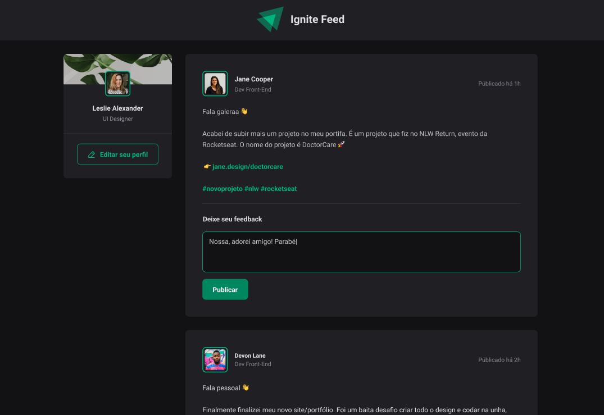

### `Tentativa de clonar o layout antes de ver o gabarito na videoaula`

A tentativa foi feita imediatamente depois de terminar a Sidebar, só tem o banner e o quadrado de perfil à esquerda nesse instante, inclusive, ele falou que não precisa escrever o `Ignite Feed` no banner.

Referência no Figma

---

Resultado

Ele ainda vai mostrar mais tecnologias no desenrolar dessa página. Acredito que tá bom, tem inclusive os efeitos de hover indicados.

Acho que poderia ter feito a parte do HTML melhor, e como consequência a organização da estilização melhoraria também.

A propriedade do HR também tá um pouco diferente do que é pra ser, mas enfim, não vou resolver isso.

Tá tocando Britney Spears Toxic agora.
