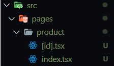

# Next.js

É uma tecnologia usada em conjunto com o **React**

Cria mais uma camada entre o front-end e o backend

Criar o projeto com o **Next** `npx create-next-app@latest`

## File-system routing

Roteamento baseado em arquivos

Arquivos criados dentro da pasta **`pages`** serão rotas

Então `index.tsx` é um arquivo padrão para a rota `'localhost:3000/'`

Para uma página de produto, basta criar um arquivo `product.tsx`

Criar o componente React

```tsx
export default function Product() {
  return <h1>Product</h1>
}
```

A rota será `localhost:3000/product`

---

Para acessar dinamicamente ex.: `localhost:3000/product/:id`

Criar uma pasta com nome `product`

Criar arquivo com **nome parametrizado**: `[id].tsx`

A partir desse momento, qualquer acesso à `localhost:3000/product/<alguma-coisa>` vai ser passado como parâmetro para esse arquivo

E o parâmetro pode ser acessado da seguinte maneira:

```tsx
import { useRouter } from 'next/router'

export default function Product() {
  const { query } = useRouter()
  return <h1>{JSON.stringify(query)}</h1>
}
```



O problema é que qualquer coisa pode ser recebida como id

---

## Stitches

Biblioteca para estilização de componentes

`npm i @stitches/react`

`import { createStitches } from '@stitches/react'

Configurando o **`Stitches`** + criando temas globais no arquivo em `src/styles/index.ts`

```tsx
import { createStitches } from '@stitches/react'

export const {
  config,
  styled,
  css,
  globalCss,
  keyframes,
  getCssText,
  theme,
  createTheme,
} = createStitches({
  theme: {
    colors: {
      rocketseat: '#8257e6',
    },
  },
})
```

Temas globais != Estilização global

Temas basicamente é a paleta de cores da aplicação.

Estilização global se faz com a propriedade `globalCss` da seguinte maneira:

Em `src/styles/global.ts`, criar a estilização

```tsx
import { globalCss } from '.'

export const globalStyles = globalCss({
  '*': {
    margin: 0,
    padding: 0,
  },

  body: {
    backgroundColor: '$gray900',
    color: '$gray100',
    '-webkit-font-smoothing': 'antialiased',
  },

  'body, input, textarea, button': {
    fontFamily: 'Roboto',
    fontWeight: 400,
  },
})
```

Em `src/pages/_app_.tsx`, importar e aplicar o método `globalCss`

```tsx
import type { AppProps } from 'next/app'
import { globalStyles } from '../styles/global' // isso

globalStyles() // e isso

export default function App({ Component, pageProps }: AppProps) {
  return <Component {...pageProps} />
}
```

Criando componente com o **`Stitches`**

```tsx
const Button = styled('button', {
  backgroundColor: '$rocketseat',
  borderRadius: 4,
  border: 0,
  padding: '0.75rem 2rem',

  span: {
    color: 'Red',
    fontWeight: 'bold',
  },

  '&:hover': {
    filter: 'invert(100%)',
  },
})
```

---

## Elementos comuns a várias páginas

Elementos que serão compartilhados por todas as páginas, por exemplo, o cabeçalho, podem ser colocados no arquivo `_app.tsx`.

---

## Rodar a requisição da API no server side

Por que fazer isso?

Ao usar o **useEffect** do **React** para fazer requisição de alguma imagem, a página carrega, useEffect é disparado e então a requisição à API é concluída, ou seja, ainda é necessário a aplicação de JavaScript para o conteúdo página ser carregado completamente. Isso é ruim para a SEO já que crawlers não executam JS.

- Exportando uma função chamada `getServerSideProps`, realiza o Server-Side-Rendering de uma página toda vez que ela for carregada.
- Next.js vai pré renderizar essa página em cada request usando os dados retornados pelo `getServerSideProps`

```jsx
// SSR

export const getServerSideProps: GetServerSideProps = async () => {
  // retorna uma lista de objetos HomeProps resultantes da requisição à API.
  return {
    props: {
      products,
    },
  }
}

export default function Home({ products }: HomeProps[]) {
  // renderiza em tela os objetos
}
```

Mas no Next, um HTML pronto é retornado para o usuário, então rodando as requisições no lado do servidor, montando um HTML estático, guardando-o em cache e retornando esse cache para o usuário, é possível diminuir o número total de requisições à API. É assim que conseguimos o melhor do Next.

E esse é o conceito de **SSG (static site generation)**.

Exemplo.: Uma vez por dia o servidor renderiza uma versão da página e a armazena em cache. Todos os usuários que acessarem no mesmo dia, receberão o mesmo HTML/CSS/JS quando acessarem o site.

Como fazer isso no Next? É só trocar `getServerSideProps` (SSR) por `getStaticProps` (SSG)

```jsx
// SSG

export const getStaticProps: GetStaticProps = async () => {
  // Igual o código do getServerSideProps
  // ...
  return {
    props: {
      products,
    },
    revalidate: 60 * 60 * 24, // a cada 24 horas refaz a página
  }
}
```

Em termos de desenvolvimento, não muda nada, as páginas ainda vão recarregar como no método SSR, mas em produção ocorre o armazenamento em cache e distribuição.

E outro detalhe importante é que ao usar SSG, não é possível ter acesso a informações do usuário como cookies, headers do request etc.
