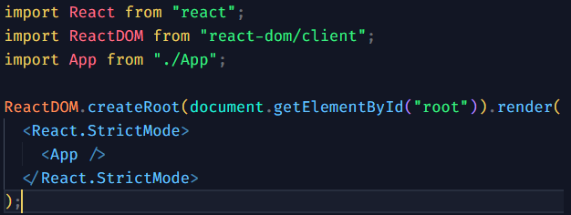

# Fundamentos do ReactJS </img>

`ReactJS` é uma biblioteca pra construção de interfaces (front-end).

---

## `SPA`

`Single Page Application` é um modelo de criação de aplicações onde toda a funcionalidade está em uma única página.

A `SPA` é composta por duas aplicações **separadas**: o back-end com `NodeJS` e o front-end com `React` (no nosso caso).

**`Desacoplados dessa maneira`**, o back-end tem sua função de lidar com a comunicação, processamento, banco de dados, e infraestrutura da aplicação web enquanto o front-end é responsável pela interação do usuário com a página. Repetindo, **`desacoplados`** .

Isso abre a possibilidade de uma aplicação ter múltiplos front-ends, ex.: Navegador, Android, IOS, API, etc.

A comunicação entre as camadas back e front é feita usando objetos **`JSON`**, que é o padrão quase universal adotado pelas linguagens de programação para comunicação entre sistemas, e tende a continuar sendo o maior padrão.

---

## `Bundlers & Compilers`

Muitas vezes, a versão das tecnologias em que estamos desenvolvendo não é suportada em sistemas mais antigos, e por isso a gente precisa usar ferramentas que traduzem as nossas criações para uma linguagem que esses navegadores legados entendam.

Aqui que entram os **`Compilers`** :

Um **`Compiler`** converte o nosso código de um formato pra outro ex.: `Babel`

Também, com o desenvolvimento das aplicações, se tornou necessário criar várias pastas e arquivos `.js` para melhorar a organização dos projetos, e a junção desses arquivos monta a totalidade da aplicação, mas isso não é/era suportado pela maioria dos navegadores, então foram criadas ferramentas chamadas **`Bundlers`** .

O motivo desse problema é que os navegadores só conseguiam ler arquivos `.js` pela tag `<script>`, e com múltiplos arquivos fazendo referências uns aos outros, não era possível importar todos em uma única tag.

Um **`Bundler`** navega pelas pastas do projeto, coletando todos os arquivos necessários para a aplicação e converter para um único arquivo `.js`, assim fazendo funcionar nos navegadores. ex.: `Webpack`

**`Finalmente,`**

com a constante evolução dos navegadores, o uso de `Bundlers` e `Compilers` estão se tornando menos necessários, e outras ferramentas de construção de projetos como **`vite.js`** e **`snowpack`** que facilitam a experiência do desenvolvedor estão aparecendo.

---

## `Setup de um projeto React`

Será usado o **`vite.js`** como template para construção do projeto React.

**`npm create vite@latest`** cria a estrutura básica.


**`npm install`** instala dependências necessárias.

**`npm run dev`** executa o projeto no localhost


Alterações feitas nos arquivos do projeto irão refletir instantaneamente no browser, então não é necessário ficar dando reload no browser.

---

## `Analisando a estrutura`

Removeremos tudo da pasta `src` exceto `App.jsx` e `main.jsx`, e todas as referências aos arquivos apagados dos remanescentes.

Também remover todo o conteúdo de `App.jsx` não importante para o entendimento:

```jsx
function App() {
  return <h1>Hello World!</h1>;
}

export default App;
```

Na raiz do projeto, temos um **`ìndex.html`** com um `<body>` contendo apenas duas tags.

```html
<body>
  <div id="root"></div>
  <script
    type="module"
    src="/src/main.jsx"
  ></script>
</body>
```

`<script type="module ...` type="module" faz referência à funcionalidade dos browsers que conseguem suportar importação dinâmica de arquivos `.js`

`<script ... src="/src/main.jsx>"` importa o arquivo `main.jsx` como script

Observamos também que existe uma `<div id="root"></div>` vazia, mas ainda assim temos um "Hello World!" aparecendo no localhost.

Inspecionando o elemento no navegador vê-se que a div #root tem um elemento h1 dentro dela. Ok, então conluímos que **o React consegue injetar HTML dentro de #root**.

Em **`main.jsx`** temos:



**`import React from "react"`** importa o núcleo do React que da suporte a todos os ambientes

**`import ReactDOM from "react-dom/client"`** importa a integração do core do React com a **`DOM`** que é a representação dos objetos que compõem o conteúdo de uma página web.

**`ReactDOM.createRoot(document.getElementById("root")).render(...);`** vemos que o **`ReactDOM`** cria sua 'raiz' recebendo o elemento de id #root, e nele renderiza (mostra em tela) um conteúdo.

Esse conteúdo é muito semelhante a tags **`HTML`**, mas são componentes do **`React`**, e um deles é **`<App />`**, o nosso arquivo **`App.jsx`**, que está sendo importado e contém somente um **`<h1>Hello World!</h1>`** sendo retornado.

Nota-se que **`index.html`** não tem nada no seu interior. A capacidade de criação e manipulação de elementos está totalmente na mão do **`React`**, ou seja, na mão do **`JavaScript`** a ser criado nesse projeto, então sem JS não temos interface.

---

## `Componentes React`

Um componente pode ser entendido como um pedaço menor da aplicação que pode ser reutilizada.

Um **`componente React`** é uma função que retorna `HTML`, e tem como extensão **`.jsx`** que vem de `JavaScript + XML <=> JSX`.

O **`retorno de um componente React deve ser UM elemento HTML`**, que pode ter vários outros dentro, mas devidamente embrulhado, como um 'pacote' fechado.

```jsx
export function App() {
  return (
    <div>
      <p>Something</p>
      <p>Somethingelse</p>
      <p>Somethingother</p>
      <p>Somethingbutnotthat</p>
    </div>
  );
}
```

Seguindo na mesma ideia, **`componentes podem importar outros componentes`**, assim permitindo reaproveitamento de código em vários níveis.

ex.:

```jsx
export function Post() {
  return <p>Post</p>;
}
```

```jsx
import { Post } from "./Post";

export function App() {
  return (
    <div>
      <Post />
      <Post />
      <Post />
      <Post />
    </div>
  );
}
```

---

## `Propriedades React`

Propriedades são informações que podemos passar pra componentes.

É possível passar para **`componentes React`**, da mesma forma que passamos atributos para tags HTML, informações que o componente possa precisar, essas são as **`Propriedades React`**.

```jsx
export function App() {
  return (
    <div>
      <Post
        author="Lucas Galax1y"
        content="Why should there be content?"
      />
    </div>
  );
}
```

As propriedades vão ficar armazenadas como objeto em uma variável chamada **`props`** no **`componente React`** em que foram passadas.

E elas podem ser acessadas dessa forma.:

```jsx
// props: {author: "Lucas Galax1y", content: "Why should there be content?"}

export function Post(props) {
  return (
    <p>
      {props.author} once said "{props.content}"
    </p>
  );
}
```

---

## `CSS Modules`

Estilização de um projeto React não é feita pelo **`index.html`**.

Todas as importações são feitas pelos arquivos **`.jsx`**, ex.:

Em **`App.jsx`** fazemos **`import './styles.css'`** e a estilização já será aplicada.

Um detalhe é que estamos, na prática, trabalhando com `JavaScript`, e dependendo do escopo onde o arquivo `CSS` é importado, o acesso à estilização é restrito a alguns componentes. Isso se chama **`Scoped CSS`**

Contrastando com o funcionamento normal do `CSS`, onde temos um escopo global e a necessidade de tomar cuidado com os nomes e possíveis efeitos indesejados quando estilizando múltiplos elementos com o mesmo seletor, a separação da estilização em componentes, como propõe o **`CSS Modules`** resolve esse problema.

Os estilos de um componente no padrão **`CSS Modules`**

1. Vivem em um único lugar
2. Só se aplicam àquele componente e nenhum outro

Então vamos criar um componente **`<Header />`** e sua estilização seguindo o padrão mostrado no Figma e ainda melhorar a organização com uma pasta `components`.


Componentes React devem ter a primeira letra maiúscula para não confundir com elementos HTML como `<header>`.

O **`<Header />`** por enquanto só vai conter um texto e estilização simples:

**`Header.module.css`**

```css
.header {
  background-color: #333;
  height: 80px;
}
```

Aqui foi usado um seletor de classe para criar a estilização.

**`Header.jsx`**

```jsx
import styles from "./Header.module.css";

export function Header() {
  return (
    <header className={styles.header}>
      <strong>Ignite Feed</strong>
    </header>
  );
}
```

E para aplicar a classe no arquivo `.jsx` é um pouco diferente, já que estamos em `JavaScript` e a palavra `class` é reservada, então usa-se **`className`**

E como estamos em `JavaScript`, e não `CSS`, `className="header"` não funciona.

Pegando a importação do `CSS` e colocando um nome, ex.: `styles`, temos a estilização como um objeto, e agora podemos fazer **`className={ styles.header }`**, assim a estilização é aplicada.

Agora só falta entrar em `main.jsx`, importar o componente e usá-lo.

```jsx
...
import { Header } from "./components/Header";

ReactDOM.createRoot(document.getElementById("root")).render(
  <React.StrictMode>
    <Header />
    <App />
  </React.StrictMode>
);
```

Ok, assim que se usa **`Scoped CSS`** no **`React`**. Agora veremos as estilizações globais - **`Global CSS`** pra setar fonte padrão, plano de fundo, cor padrão de texto, etc.

Criando um arquivo `global.css` e aplicando em `App.jsx` :

```jsx
...
import "./global.css";

export function App() {
  ...
}
```

```css
* {
  margin: 0;
  padding: 0;
  box-sizing: border-box;
}

...
```

Imagens também devem ser importadas no "modo JavaScript", então se fossemos adicionar um logo, teríamos em um `componente React`:

```jsx
import logo from "../assets/logo.svg";

export function genericComponent() {
  return (
    <div>
      
    </div>
  );
}
```

É importante quando a gente tá desenvolvendo uma aplicação front-end, que o dimensionamento dos componentes seja feito em valores relativos como `rem`.

Usuários no Reddit comentam:

```
px for large and very small things (under 4px).

rem for padding, margin, font size, and things like that.
It's relative to the font size on the page and scales well when users scale their font sizes.
You can use it for large things too, it just becomes a hassle when using it for
image sizes, widths, or breakpoints.
```

```
px for small things.

rem for dynamic styles where you want things to be changed according to the font-size
```

```
Pixels are almost never used (by me). They can be useful when things should not be relative, which is rare.
```

---

Nessa altura, a Sidebar tava pronta e eu tentei criar o componente `<Post />` por mim mesmo e postei o resultado na branch `attempt-post`, o README.md desse branch tem tudo resumido.

O roteiro para o desenvolvimento das páginas é:

1. HTML - Estrutura da página já deve estar relativamente pensada, atribuir classNames
2. CSS - Estilização
3. React - Responsividade

Quando alguma coisa repete muito em tela, provavelmente isso deveria virar um `Componente React`, é o caso das imagens na página do Ignite Feed. Então foi criado um componente `<Avatar />`

---

## `Usando Propriedades React como condição para estilização`

Podemos criar Propriedades React livremente quando usamos os componentes, tornando muito fácil enviar flags pra dentro das suas implementações. E lá dentro avaliamos a informação facilmente, afinal, é JavaScript.

Instanciando o componente e enviando flag pela propriedade:

```html
<Avatar
  hasBorder="{false}"
  src="https://github.com/galax1y.png"
/>
```

Recebendo as informações no componente e processando:

```jsx
export function Avatar(props) {
  return (
    
  );
}
```

De outra maneira, melhor, com valor padrão e desempacotando:

```jsx
export function Avatar({ hasBorder = true, src }) {
  return (
    
  );
}
```

Essa maneira é melhor, o valor padrão para `hasBorder` é `true`, então só é necessário mandar a flag quando for necessário passar `false` para a propriedade. Também, é um código mais legível, sem chaining.

---

## `Tornando a aplicação mais responsiva`

A estrutura dessa página é estilizada da seguinte forma:

```css
.wrapper {
  max-width: 70rem;
  margin: 2rem auto;
  padding: 0 1rem;

  display: grid;
  grid-template-columns: 256px 1fr;
  gap: 2rem;
  align-items: flex-start;
}
```

Não é muito responsiva para dispositivos com tela menor, porque é travado em duas colunas, sendo que uma delas tem 256px fixos e como a gente tem visto, unidades relativas são muito melhores.

Podemos adicionar um comando que muda essa estrutura de acordo com o tamanho da tela que está acessando.

```css
@media (max-width: 768px) {
  .wrapper {
    grid-template-columns: 1fr;
  }
}
```

Essa é uma solução simples com `media queries` que torna a página em uma coluna dependendo da largura máxima da tela, então a `Sidebar` vai se posicionar no topo, e então vem os componentes `Post`


---
