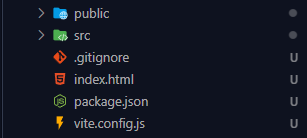
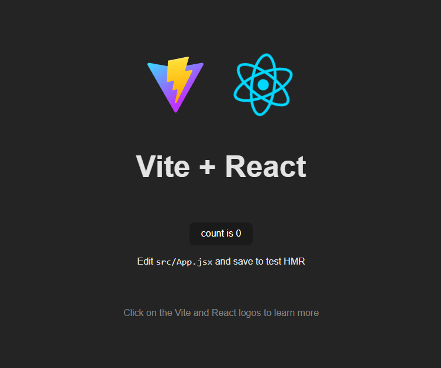

# Fundamentos do ReactJS </img>

`ReactJS` é uma biblioteca pra construção de interfaces (front-end).

---

## `SPA`

`Single Page Application` é um modelo de criação de aplicações onde toda a funcionalidade está em uma única página.

A `SPA` é composta por duas aplicações **separadas**: o back-end com `NodeJS` e o front-end com `React` (no nosso caso).

**`Desacoplados dessa maneira`**, o back-end tem sua função de lidar com a comunicação, processamento, banco de dados, e infraestrutura da aplicação web enquanto o front-end é responsável pela interação do usuário com a página. Repetindo, **`desacoplados`** .

Isso abre a possibilidade de uma aplicação ter múltiplos front-ends, ex.: Navegador, Android, IOS, API, etc.

A comunicação entre as camadas back e front é feita usando objetos **`JSON`**, que é o padrão quase universal adotado pelas linguagens de programação para comunicação entre sistemas, e tende a continuar sendo o maior padrão.

---

## `Bundlers & Compilers`

Muitas vezes, a versão das tecnologias em que estamos desenvolvendo não é suportada em sistemas mais antigos, e por isso a gente precisa usar ferramentas que traduzem as nossas criações para uma linguagem que esses navegadores legados entendam.

Aqui que entram os **`Compilers`** :

Um **`Compiler`** converte o nosso código de um formato pra outro ex.: `Babel`

Também, com o desenvolvimento das aplicações, se tornou necessário criar várias pastas e arquivos `.js` para melhorar a organização dos projetos, e a junção desses arquivos monta a totalidade da aplicação, mas isso não é/era suportado pela maioria dos navegadores, então foram criadas ferramentas chamadas **`Bundlers`** .

O motivo desse problema é que os navegadores só conseguiam ler arquivos `.js` pela tag `<script>`, e com múltiplos arquivos fazendo referências uns aos outros, não era possível importar todos em uma única tag.

Um **`Bundler`** navega pelas pastas do projeto, coletando todos os arquivos necessários para a aplicação e converter para um único arquivo `.js`, assim fazendo funcionar nos navegadores. ex.: `Webpack`

**`Finalmente,`**

com a constante evolução dos navegadores, o uso de `Bundlers` e `Compilers` estão se tornando menos necessários, e outras ferramentas de construção de projetos como **`vite.js`** e **`snowpack`** que facilitam a experiência do desenvolvedor estão aparecendo.

---

## `Setup de um projeto React`

Será usado o **`vite.js`** como template para construção do projeto React.

**`npm create vite@latest`** cria a estrutura básica.



**`npm install`** instala dependências necessárias.

**`npm run dev`** executa o projeto no localhost



Alterações feitas nos arquivos do projeto irão refletir instantaneamente no browser, então não é necessário ficar dando reload no browser.

---

## `Analisando a estrutura`

Removeremos tudo da pasta `src` exceto `App.jsx` e `main.jsx`, e todas as referências aos arquivos apagados dos remanescentes.

Também remover todo o conteúdo de `App.jsx` não importante para o entendimento:

```jsx
function App() {
  return <h1>Hello World!</h1>;
}

export default App;
```

Na raiz do projeto, temos um **`ìndex.html`** com um `<body>` contendo apenas duas tags.

```html
<body>
  <div id="root"></div>
  <script type="module" src="/src/main.jsx"></script>
</body>
```

`<script type="module ...` type="module" faz referência à funcionalidade dos browsers que conseguem suportar importação dinâmica de arquivos `.js`

`<script ... src="/src/main.jsx>"` importa o arquivo `main.jsx` como script

Observamos também que existe uma `<div id="root"></div>` vazia, mas ainda assim temos um "Hello World!" aparecendo no localhost.

Inspecionando o elemento no navegador vê-se que a div #root tem um elemento h1 dentro dela. Ok, então conluímos que **o React consegue injetar HTML dentro de #root**.

Em **`main.jsx`** temos:


**`import React from "react"`** importa o núcleo do React que da suporte a todos os ambientes

**`import ReactDOM from "react-dom/client"`** importa a integração do core do React com a **`DOM`** que é a representação dos objetos que compõem o conteúdo de uma página web.

**`ReactDOM.createRoot(document.getElementById("root")).render(...);`** vemos que o **`ReactDOM`** cria sua 'raiz' recebendo o elemento de id #root, e nele renderiza (mostra em tela) um conteúdo.

Esse conteúdo é muito semelhante a tags **`HTML`**, mas são componentes do **`React`**, e um deles é **`<App />`**, o nosso arquivo **`App.jsx`**, que está sendo importado e contém somente um **`<h1>Hello World!</h1>`** sendo retornado.

Nota-se que **`index.html`** não tem nada no seu interior. A capacidade de criação e manipulação de elementos está totalmente na mão do **`React`**, ou seja, na mão do **`JavaScript`** a ser criado nesse projeto, então sem JS não temos interface.

---
