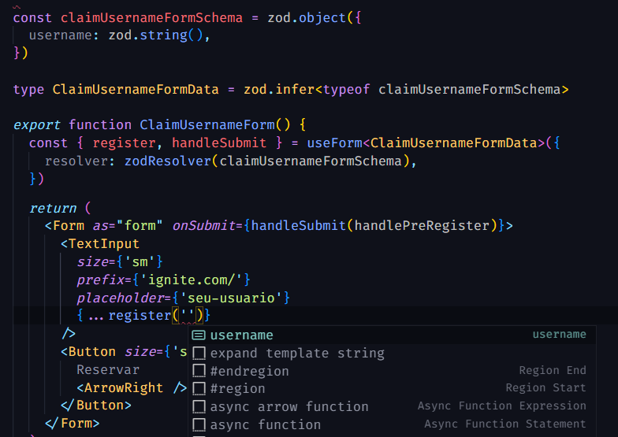
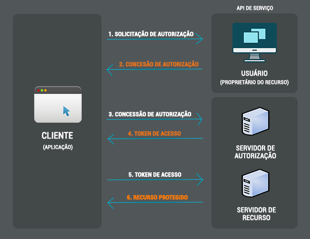

# Projeto Ignite Call

O projeto mais completo até agora, usando `Next.js`, o `Design System` construído no projeto 5, `zod` para validação, `prisma` para ORM, `integrar c/ API` do Google Calendar, e muito mais. O resumo, assim como o do projeto 5, vai ficar bem curto, contendo comandos novos / para relembrar / configurações iniciais que são difíceis de lembrar.

Criar projeto com **`Next.js`**
`npx create-next-app@latest --use-npm`

Instalando fontes no **`Next.js`** e configurando o `Stitches`

Em `src/_document.tsx` adicionar no `Head` os links coletados no Fonts Google

```tsx
// prettier-ignore
<Head>
  {/* Adiciona as fontes */}
	<style
	<link rel="preconnect" href="https://fonts.googleapis.com" />
	<link rel="preconnect" href="https://fonts.gstatic.com" crossOrigin="anonymous" />
	<link	href="https://fonts.googleapis.com/css2?family=Roboto:wght@400;500;700&display=swap" rel="stylesheet" />

	{/* Faz o Stitches funcionar */}
	<style
		id="stitches"
		dangerouslySetInnerHTML={{ __html: getCssText() }}
	></style>
</Head>
```

Estilizando componentes da biblioteca pronta pelo Stitches

No `src/componenteX/styles.ts`

```ts
import {styled, Heading} from '@ignite-ui/react'

export const Hero = styled('div', {
	maxWidth: 480,
	padding: '0 $10',

	[`${Heading}`]: {
		color: 'red',
	},
})
```

---

### react-hook-form

Biblioteca pra criação de inputs de usuário controlados ou não-controlados no React. Comum pra validação e performática.
`npm i react-hook-form`

Biblioteca para validação integrada com TypeScript. Pode inferir tipos a partir de variáveis ou objetos.
`npm i zod`

Resolver que faz o **`zod`** e outras bibliotecas externas funcionar com o **`react-hook-form`**.
`npm i @hookform/resolvers`

Instalar tudo junto
`npm i react-hook-form @hookform/resolvers zod`

Exemplo básico **`react-hook-form + zod + @hookform/resolvers/zod`**

```jsx
import { useForm } from 'react-hook-form'
import * as zod from 'zod'
import { zodResolver } from '@hookform/resolvers/zod'

// Criando o schema informando os campos que o form deve retornar e validando
const claimUsernameFormSchema = zod.object({
	username: z.string()
	.min(3), // Exemplo de validação. Tem MUITAS.
})

// A partir do schema, é possível criar o tipo do objeto no TypeScript
type ClaimUsernameFormData = zod.infer<typeof claimUsernameFormSchema>

// Se a validação passar, esse código vai ser rodado
async function handleUsernameFormSubmit(data: ClaimUsernameFormData) {
	...
}

// E isso é usado no generic do useForm, assim evita erros futuros no form, já que os campos que existem já estão declarados
// Autocomplete também passa a funcionar quando registra uma informação
export function claimUsernameForm() {
	const { register, handleSubmit } = useForm<ClaimUsernameFormData>(
		// Objeto de configuração do useForm deve apontar o resolver do zod vindo de @hookform/resolvers/zod
		// O schema deve ser fornecido ao resolver!!
		{
    	resolver: zodResolver(claimUsernameFormSchema),
    }
	)

	// Criando um input controlled/uncontrolled com uso do react-hook-form
	<form onSubmit={handleSubmit(handleUsernameFormSubmit)}>
		<TextInput {...register('username')} />
		<button type="submit">
	<form>
}
```

A validação nesse caso já tá funcionando, ele não vai passar o conteúdo à função



Para adicionar campos que o formulário deve coletar é só:

1. Adicionar o campo no Schema, tipar e validar
2. Registrar o elemento (input) que vai coletar esse campo

Mensagens de erro são acessadas usando o useForm:

```jsx
// prettier-ignore
const {
	register,
	handleSubmit,
	formState: { errors }, // Acesso aos erros
} = useForm<ClaimUsernameFormData>(
	{resolver: zodResolver(claimUsernameFormSchema)}
	)

// E assim mostrar a informação em tela
// prettier-ignore
{errors.username?.message}

// Outra maneira seria: verificar se isso é um booleano true, e então renderizar um componente estilizado
{
	!!errors.username?.message && <ErrorMessageComponent />
}
```

Redirecionamento no `Next.js` passando parâmetros na query:

```jsx
async function handlePreRegister(data: ClaimUsernameFormData) {
	const {username} = data

	// redirecionamento
	await router.push({pathname: '/register', query: {username}})
}
```

Um argumento `as` pode ser passado para o `router.push` para que os query params não apareçam na url do usuário
ex.: `await router.push({pathname: '/register', query: {username}}, '/register')`
Porém, se o usuário der um F5 na página, o autocomplete não vai estar mais lá, afinal os query params sumiram

No arquivo que recebe o redirecionamento:

```jsx
export default function Register() {
	// recebe os parâmetros
	const router = useRouter()

	// acessa os parâmetros
	console.log(router.query.username)
}
```

---

### Prisma - ORM altamente integrado ao TypeScript

Tem integração com o **`Next.js`** e com o **`TypeScript`** então o autocomplete é muito forte
Também tem uma extensão no VSCode pra syntax highlighting

Instalação da CLI do Prisma:
`npm i prisma -D`

Dependência para lidar com o banco de dados (leitura, escrita, alterações, remoções):
`npm i @prisma/client`

Inicializar o Prisma:
`npx prisma init --datasource-provider SQLite`
SQLite é só uma das opções, as opções disponíveis são: `cockroachdb`, `mongodb`, `mysql`, `postgresql`, `sqlite`, `sqlserver`

Comando pra rodar a migration:
`npx prisma migrate dev`

Comando pra rodar o Prisma Studio (visualização do banco de dados):
`npx prisma studio`

Criando um modelo de dados

```prisma
model User {
  id       String @id @default(uuid()) // @id -> primary key - @default -> valor padrão - uuid() -> gera um número aleatório
  username String @unique // podemos indicar se um campo deve ser único
  name     String
  created_at DateTime @default(now()) // now() -> cria um timestamp quando uma entrada é criada

  @@map("users") // define o nome da tabela no banco de dados
}
```

Feito isso é só rodar a migration

Criando uma entrada no banco de dados

Devemos ter um Prisma Client

```ts
import {PrismaClient} from '@prisma/client'

export const prisma = new PrismaClient({
	log: ['query'],
})
```

E quando um gatilho ex.: API Route for acionado, com os dados sendo passados pelo corpo da requisição:

```ts
export default async function handler(
	req: NextApiRequest,
	res: NextApiResponse,
) {
	// devemos definir melhor o método HTTP válido para essa API Route
	if (req.method !== 'POST') {
		return res.status(405).end()
	}
	// pegando os dados no request body
	const {username, name} = req.body

	// criando a entrada no banco de dados
	const user = await prisma.user.create({data: {name, username}})

	// retornando mensagem de sucesso para o usuário
	return res.status(201).json(user)
}
```

Um detalhe é que se um campo for único, devemos fazer a validação como se fosse um backend de verdade.
Caso contrário causaremos vários erros 500 (Internal Server Error)

Solução:

```ts
// verifica na tabela user, nos campos únicos (que são o id e o username)
// se o username passado no req.body já está sendo usado em alguma entrada
const userExists = await prisma.user.findUnique({where: {username}})

// se sim, retornamos um erro ao usuário
if (userExists)
	return res.status(400).json({message: 'username is already taken'})
```

---

### Identificando o usuário ao longo do processo de cadastro usando **`Cookies`**

Acessar cookies e mandar cookies para o navegador do usuário é fácil

```ts
export default async function handler(
	req: NextApiRequest,
	res: NextApiResponse,
) {
	req.cookies // coleta os cookies
	res.setHeader('Set-Cookie', []) // seta cookies
}
```

Essa API é um pouco complicada de trabalhar com o Cookies, então foi sugerido usar outra biblioteca chamada **`nookies`**
`npm i nookies`

Ela usa uma biblioteca chamada `cookie` por baixo dos panos e não vem com tipagem TypeScript inclusa então:
`npm i @types/cookie -D`

Criando um cookie com o **`nookies`**

```ts
import {setCookie} from 'nookies'
export default async function handler(
	req: NextApiRequest,
	res: NextApiResponse,
) {
	// depois de criar o usuário no banco de dados, setar o cookie
	// setCookie({}, '@nome-cookie', dados-cookie, {config})
	setCookie({res}, '@ignitecall-galaxy:userId', user.id, {
		maxAge: 60 * 60 * 24 * 7, // 7 days until cookie expiration
		path: '/register', // routes that can access this cookie
	})
}
```

---

### Protocolo de autenticação **`OAuth`**

É um protocolo para autorização de usuários da Internet em sites de terceiros sem expor credenciais ex.: senhas. É padrão na indústria para uso em autenticação em vários serviços populares como `Google`, `Facebook`, `Discord`, `Dropbox`, `Twitter`, `Twitch` etc.

Se encontra na versão 2.0 e segue o seguinte fluxo de autorização


**[Mais informações sobre integração do Next.js com autenticação](https://nextjs.org/docs/authentication)**

O `Next.js` tem uma biblioteca que automatiza muito do processo de autenticação, é a **[next-auth](next-auth.js.org)**
`npm i next-auth`
